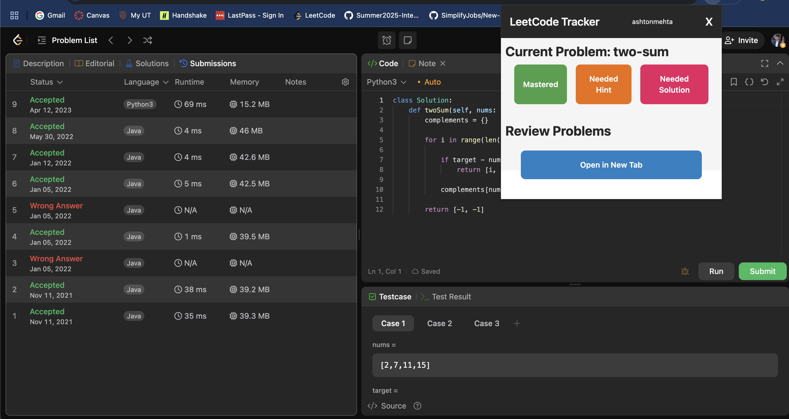
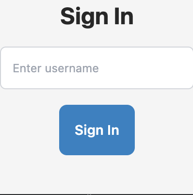

# LeetTrack Chrome Extension

LeetTrack is a Chrome extension designed to help you track your LeetCode practice progress and guide you towards mastery. By marking problems as "Mastered", "Needed Hint", or "Needed Solution", the extension uses a spaced repetition technique to recommend problems to work on every day, ensuring that you steadily build your skills over time.




## Features

- **Progress Tracking:**  
  Mark problems with one of three statuses:

  - **Mastered:** Problems you’ve confidently solved.
  - **Needed Hint:** Problems where you might need a hint.
  - **Needed Solution:** Problems that require a full solution review.

- **Spaced Repetition:**  
  Based on your progress, the extension uses spaced repetition to recommend problems on a daily basis, helping you reinforce learning and achieve long-term mastery.

- **User-Friendly Interface:**  
  Built with React and styled with TailwindCSS for a modern, responsive, and intuitive user experience.

## Technologies Used

- **React with TypeScript:**  
  Provides a robust foundation for building interactive user interfaces with strong type checking.

- **React Redux & Redux Toolkit:**  
  Manages application state efficiently, ensuring a smooth and responsive user experience.

- **TailwindCSS:**  
  Speeds up styling and design with utility-first CSS classes, making it easy to maintain and customize.

## Getting Started

### Prerequisites

- Node.js (version 14 or later)
- npm package manager
- Chrome Browser (for running the extension)

### Installation

1. **Clone the Repository:**

   ```bash
   git clone https://github.com/ashtonmehta/lc-extension.git
   cd lc-extension
   ```
